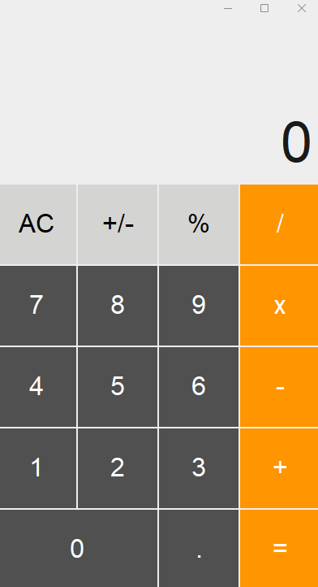

# Basic Calculator

Simple calculator using customtkinter.

App was made following [this](https://www.youtube.com/watch?v=mop6g-c5HEY&ab_channel=ClearCode) tutorial made by youtuber Clear Code.

### Features

- Supports basic operations (+, -, *, /)
- Positive and negative numbers
- Decimal numbers
- Clear
- Percent
- Sign invert
- Formula showcase
- Light and Dark modes (based on user's OS settings)

## Demo

# Light Theme

## Usage

1. Run 'python calculator.py'
2. Operate